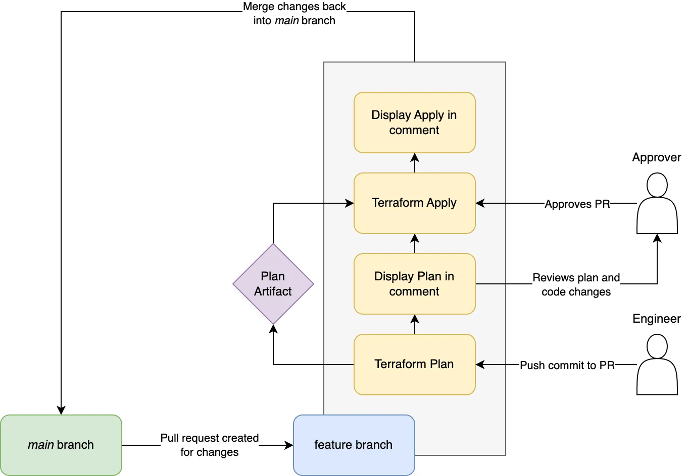

# WebAPI Infrastructure Deployment

This README provides step-by-step instructions for deploying the WebAPI infrastructure using Terraform on AWS. The infrastructure is modularised for flexibility and integrates with GitHub Actions for automated deployment.

## Prerequisites

- AWS Account with Administrator access.
- Terraform 
  ```sh
  # Installtion commands

  brew tap hashicorp/tap
  brew install hashicorp/tap/terraform
  ```
- GitHub account and access to this repository.
- Fork this repo to use locally

## Repository Structure Overview

- .github/workflows: CI/CD with GitHub Actions.
- environments: Environment-specific Terraform variable files (for test, dev and prod; add as necessary)
- modules: Reusable Terraform modules for network, ECS, RDS, etc.

---
## Step-by-Step Deployment Guide

### 1: Configuring AWS credentials for Github Actions=

- Go to your GitHub repository's settings.
- Navigate to Secrets and add your AWS credentials:
  - AWS_ACCESS_KEY_ID: Your AWS Access Key.
  - AWS_SECRET_ACCESS_KEY: Your AWS Secret Access Key.
These credentials will be used by GitHub Actions to deploy resources to AWS.

### 2: Environment Configuration

The environments folder contains .tfvars files for different environments (dev, test, prod). Configure these files according to your needs.

For example, to set up the development environment, edit dev.tfvars:

```hcl
# Development Environment
aws_region = "us-west-2"

# VPC Configuration
vpc_cidr = "10.0.0.0/16"
public_subnet_cidrs = ["10.0.1.0/24", "10.0.2.0/24"]
private_subnet_cidrs = ["10.0.3.0/24", "10.0.4.0/24"]
availability_zones = ["us-west-2a", "us-west-2b"]

# ECS Configuration
ecs_cluster_name = "dev-ecs-cluster"
ecs_task_family = "dev-task-family"
ecs_task_cpu = "256"
ecs_task_memory = "512"
ecs_container_name = "dev-container"
ecs_container_image = "dev-docker-image:latest"
ecs_container_port = 80
ecs_service_name = "dev-service"
ecs_desired_count = 1
ecs_cpu_utilization_high_threshold = 60
ecs_max_capacity = 10
ecs_min_capacity = 1
ecs_cpu_scale_up_threshold = 70
ecs_cpu_scale_down_threshold = 20

# RDS Configuration
rds_allocated_storage = 10
rds_storage_type = "gp2"
rds_engine = "mysql"
rds_engine_version = "5.7"
rds_instance_class = "db.t2.micro"
rds_db_name = "devdatabase"
rds_db_username = "devadmin"
rds_db_password = "devsecurepassword"
rds_db_parameter_family = "mysql5.7"
rds_cpu_utilization_high_threshold = 75
rds_instance_identifier = "dev-rds-instance"
```

### 3: Customising Github Actions Pipeline

The CI/CD pipeline is defined in `.github/workflows/terraform.yml.` Customize it as needed.

For example to change the region:

```yaml
env:
  AWS_DEFAULT_REGION: 'us-west-2' # Change to your desired AWS region
```

NOTE: The pipeline workflow triggers when a pull request is made to the main branch from a feature branch. This will only perform a `terraform plan`. For each respective environment

You may also have additional environments, which means you need to add the stage below to your pipeline, and change `test` to the environment you would like to add:

```yaml
  terraform_plan_test:
    name: 'Terraform Plan for Test'
    runs-on: ubuntu-latest
    if: github.event_name == 'pull_request'
    steps:
    - name: Checkout
      uses: actions/checkout@v2

    - name: Terraform Plan for Test
      id: plan-test
      run: |
        terraform init
        terraform plan -var-file=environments/test.tfvars -out=plan-test
        terraform show -no-color plan-test > plan-test.txt
      
    - name: Upload Terraform Plan Artifact for Test
      if: github.event_name == 'pull_request'
      uses: actions/upload-artifact@v2
      with:
        name: plan-test
        path: plan-test
    
    - name: Read Terraform Plan Output for Test
      if: github.event_name == 'pull_request'
      run: |
        echo "PLAN_TEST<<EOF" >> $GITHUB_ENV
        cat plan-test.txt >> $GITHUB_ENV
        echo "EOF" >> $GITHUB_ENV

    - name: Comment Test Plan Output on PR
      if: github.event_name == 'pull_request'
      uses: thollander/actions-comment-pull-request@v2
      with:
        message: |
          Terraform Test Plan Output:
          ```
          ${{ env.PLAN_TEST }}
          ```
        GITHUB_TOKEN: ${{ secrets.GITHUB_TOKEN }}
```

### 4: Terraform module usage

Modules are located in the `modules` directory. To use a module, reference it in your root Terraform configuration like below, specifying all the required variables as defined in the module:

```hcl
# main.tf
module "network" {
  source = "./modules/network"
  vpc_cidr = var.vpc_cidr
  ...
}
```

As you can see the module is also standardised (uses variables) - so you can directly make changes to your `.tfvars` files as required.


## Deployment Execution

- Push your changes or create a pull request.
- The GitHub Actions workflow will automatically run, executing `terraform plan`
- `terraform apply` will run based on a manual trigger and specifying the environment you would like to deploy to
- The diagram below shows the pipeline workflow:



## Error Handling and Debugging

1. Troubleshoot Deployment Errors:
- Check the Github Actions log for detailed error messages
- Ensure AWS credentials are set up in Github secrets

2. Handling Common Terraform Errors:
- Invalid or missing variables: Make sure all required variables are declared and have valid rules. For a more detailed variable usage, see the `terraform-docs` table generated below.

3. Debugging Terraform
- Use `terraform validate` locally to check for configuration errors.
- Run `terraform plan` locally to preview changes without applying them.

## Rollback Strategy

1. Immediate Rollback:

- If a deployment introduces issues, revert the commit in your repository and re-run the GitHub Actions workflow.
- Example Git command to revert:
  ```sh
  git revert [commit_hash]
  git push origin main
  ```

2. Terraform State Rollback:

- Use Terraform's state management features to revert specific resources to a previous state.
- Example Terraform commands for state manipulation:
  ```sh
  terraform state list
  terraform state rm [resource]
  terraform apply
  ```


---
## Terraform Module Documentation

Below is the auto-generated documentation for the webapi-infra Terraform modules, created by terraform-docs. 

This documentation provides an overview of the inputs, outputs, and a description of each module in this project. 

It is automatically updated to reflect the current state of the Terraform configurations in this repository.

### Module Documentation
<!-- BEGIN_TF_DOCS -->

<!-- END_TF_DOCS -->

This documentation is a live section maintained through the integration of terraform-docs with our CI/CD pipeline, ensuring that it always represents the latest configurations and usage information for our Terraform modules. For detailed explanations and changes, refer to the respective module directories within the project.


---
## Contributing

Modifying Infrastructure:

- To change existing infrastructure, update the Terraform configuration files and modules as needed.
- Test changes in a non-production environment first.

Adding New Modules:

- Create new modules in the modules directory.
- Ensure they are standardised, and follow the same naming pattern to existing modules

Updating GitHub Actions Workflow:

- To modify CI/CD, update the .github/workflows/terraform.yml file.
- Add additional steps or change existing ones to fit your deployment needs.